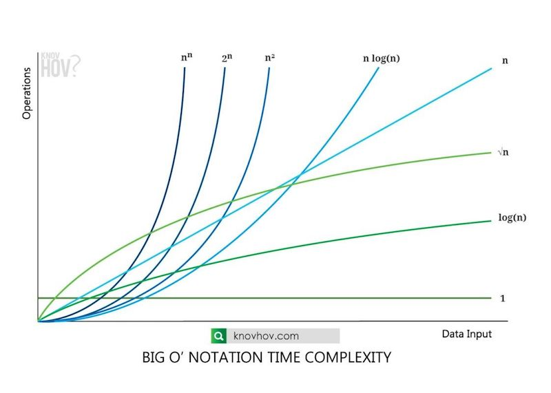

# 알고리즘 성능 평가

## 복잡도

복잡도는 어떤 **알고리즘의 성능을 평가하는 방법**을 말한다.  
이는 소스 코드가 복잡해 보이는 것과는 다른 개념으로, 특정한 함수의 성능적인 측면에서의 복잡도를 의미한다.  
만약 동일한 기능을 수행하는 알고리즘이 있다면, 일반적으로 **복잡도가 낮을수록 좋은 알고리즘**이다.  
한편 알고리즘의 복잡도는 계산 복잡도 이론에서 나온 것인데, 이 내용을 온전히 이해하려면 추가적으로 많은 내용이 필요하다.  
여기서는 알고리즘 문제를 풀기 위해서 알아야 하는 정보만을 위주로 다룬다.

### 시간 복잡도

특정한 크기의 입력에 대하여 **알고리즘의 수행 시간** 분석.  
알고리즘 문제 풀이에서 거의 대부분 사용되는 복잡도 개념.

### 공간 복잡도

특정한 크기의 입력에 대하여 **알고리즘의 메모리 사용량** 분석.  
시간 복잡도에 비해 보통 우선순위가 밀린다. "메모리 초과" 문구의 경우 해당됨.

## 빅오 표기법(Big-O Notation)

빅오 표기법은 **알고리즘의 성능을 수학적으로 표현**하는 방법이다. 이를 통해 알고리즘의 시간 복잡도와 공간 복잡도를 표현 가능.  
한편 빅오 표기법은 실제 알고리즘의 실제 러닝 타임을 재는 것이 아니라, 장기적으로 **데이터나 사용자의 증가율에 따른 알고리즘의 성능을 예측**하는게 목표인 표기법.

### 빅오 표기법 성능 차트



### Constant Time - O( $1$ )

입력 데이터의 크기에 상관없이 언제나 일정한 시간이 걸리는 알고리즘.

```java
boolean f(int[] n) {
    return (n[0] == 0) ? true : false;
}
```

입력받은 배열의 첫번째 인덱스 값이 `0`인지를 확인하는 코드.  
배열이 얼마나 크고 작은지에 상관없이 언제나 일정한 시간이 걸리므로, O( $1$ )의 시간 복잡도를 가진다고 표현함.

### Linear Time - O( $n$ )

입력 데이터의 크기에 비례해서 처리 시간이 늘어나는 알고리즘.

```java
void f(int[] n) {
    for i = 0 to n.length
        print i;
}
```

입력받은 배열의 원소를 하나씩 전부 출력하는 코드.  
$n$개의 데이터를 받으면, $n$번 반복한다. 데이터가 증가함에 따라 처리 시간도 같은 비율로 증가함.  
연산 횟수는 $1$부터 $n$까지 직선으로 나열한 개수와 같다.

### Quadratic Time - O( $n^2$ )

```java
void f(int[] n) {
    for i = 0 to n.length
        for j = 0 to n.length
            print i + j;
}
```

배열의 모든 원소 각각 $n$번 씩 $n$번 루프.  
연산 횟수는 가로, 세로 길이가 $n$인 정사각형의 면적과 같다.

### Quadratic Time - O( $nm$ )

```java
void f(int[] n, int[] m) {
    for i = 0 to n.length
        for j = 0 to m.length
            print i + j;
}
```

코드가 O( $n^2$ )과 유사. 하지만 변수가 다르다면, $n$은 엄청 크고, $m$은 엄청 작을 수도 있기 때문에 반드시 다르게 표시해야 함.

### Polynomial/Cubic Time - O( $n^3$ )

```java
void f(int[] n) {
    for i = 0 to n.length
        for j = 0 to n.length
            for k = 0 to n.length
                print i + j + k;
}
```

$n$을 3중으로 루프.  
$n^2$을 $n$만큼 더 반복하므로, 연산 횟수는 정육면체의 부피와 같다. O( $n^2$ ) 보다 더 급격한 기울기.

### Exponential Time - O( $2^n$ )

```java
int f(n, r) {
    if (n <= 0) return 0;
    if else (n == 1) return r[n] = 1;
    return r[n] = f(n - 1, r) + f(n - 2, r);
}
```

**피보나치 수열**을 재귀 함수로 구현한 코드.  
피보나치 수열은 가로, 세로 길이가 $1$인 정사각형부터 시작해서, 한 면을 기준으로 정사각형을 만드는 것.


함수를 호출할 때마다, 바로 전의 숫자와 전전 숫자를 알아야 함수의 값을 구할 수 있다. 그래서 해당 값를 알아내기 위해, 전의 숫자를 가지고 재귀호출을 하고, 전의 전 숫자를 가지고 재귀호출.


이렇게 매번 함수를 한 번 호출될 때마다 두 번씩 함수 호출한다. 이 과정을 트리의 높이 $k$ 만큼 반복.  
O( $n^3$ )보다 데이터의 증가에 따른 처리 시간이 현저히 가파름.

### Exponential Time - O( $m^n$ )

O( $2^n$ )에 해당하는 함수를 확장하여, 함수가 $m$개씩 $n$번 늘어나는 알고리즘을 표현할 때는 $2$ 대신에 $m$을 써서 표현.

### Logarithmic Time - O( $\log n$ )

한번 연산이 진행될 때마다 검색해야하는 데이터 양이 절반씩 떨어지는 알고리즘. 대표적인 알고리즘으로는 이진 검색.

```java
int f(k, arr, start, end) {
    if (start > end) return -1;
    mid = (start + end) / 2;
    if (arr[mid] == k) return mid;
    else if (arr[mid] > k) return f(k, arr, start, mid - 1);
    else return F(k, arr, mid + 1, end);
}
```

예를 들어 `1`부터 `9`까지 오름차순으로 정렬된 배열 안에서 키 값인 `6`을 찾아보는 코드.  
이렇게 코드를 작성하면 한 번 함수가 호출될 때마다 중간값을 기준으로, 절반은 검색영역에서 제외해서 순차 검색 O( $n$ )에 비교하여 속도가 훨씬 빠르다.  
또한 데이터가 증가해도 이후에는 시간이 그렇게 많이 증가하지 않는다.

### Square Root - O( $sqrt(n)$ )

제곱근 알고리즘.  
예를 들어 $n = 9$ 이면, 크기가 9인 정사각형에 숫자를 하나씩 채워서, 맨 위의 한 줄(1 2 3)이 제곱근이 된다.  
이렇게 정사각형에 $n$을 다 채워서, 맨 위 한줄만 연산하는 알고리즘이 O( $sqrt(n)$ ).

### 상수를 고려하지 않음

빅오 표기법은 실제 알고리즘의 러닝타임을 재기 위한 것이 아니라, 장기적으로 데이터가 증가함에 따른 처리 시간 증가율 예측하기 위한 표기법.  
따라서 상수는 고정된 숫자이므로 증가하지 않는 숫자는 신경쓰지 않는다.

```java
void f(int[] n) {
    for i = 0 to n.length
        print i;
    for i = 0 to n.length
        print i;
}
```

위 코드의 시간 복잡도는 O( $2n$ )이 아니라 O( $n$ ).

## 알고리즘 설계 팁

문제에서 가장 먼저 확인해야 하는 것은 **시간 제한**(수행시간 요구사항)을 확인.  
코딩 테스트 문제의 시간 제한은 **보통 1 ~ 5초** 가량이다. 명시되어 있지 않으면, 대략 5초 정도라고 풀면 좋다.  
그리고 일반적인 **컴퓨터 연산 속도는 대략 1초에 1억 번**정도 연산할 수 있다고 생각하자.

- 시간 제한이 1초인 문제를 만났을 때, 일반적인 기준
    - $N$의 범위가 500인 경우 : 시간 복잡도 O( $N^3$ ) 알고리즘 설계
    - $N$의 범위가 2,000인 경우 : 시간 복잡도 O( $N^2$ ) 알고리즘 설계
    - $N$의 범위가 100,00인 경우 : 시간 복잡도 O( $N\log N$ ) 알고리즘 설계
    - $N$의 범위가 10,000,000인 경우 : 시간 복잡도 O( $N$ ) 알고리즘 설계

## 출처

- [(이코테 2021 강의 몰아보기) 1. 코딩 테스트 출제 경향 분석 및 파이썬 문법 부수기 - YouTube](https://youtu.be/m-9pAwq1o3w)
- [[자료구조 알고리즘] 빅오(Big-O)표기법 완전정복 - YouTube](https://www.youtube.com/watch?v=6Iq5iMCVsXA)
- [빅오 표기법(Big-O notation), 시간복잡도, 공간복잡도 : 네이버 블로그](https://blog.naver.com/PostView.naver?blogId=kks227&logNo=220769859177&categoryNo=299&parentCategoryNo=0&viewDate=&currentPage=13&postListTopCurrentPage=&from=postList&userTopListOpen=true&userTopListCount=5&userTopListManageOpen=false&userTopListCurrentPage=13)
