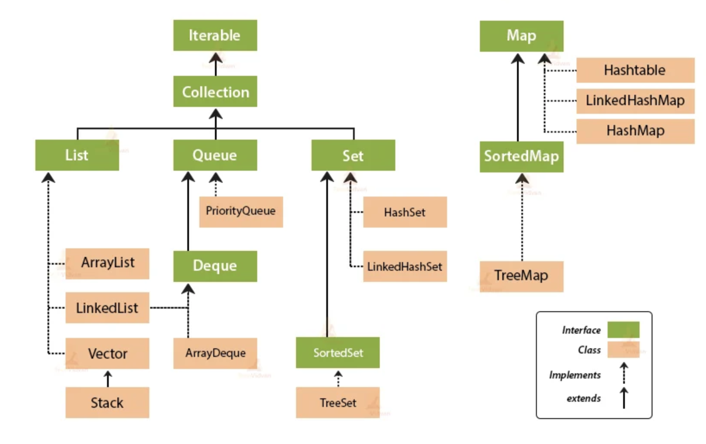

# 리스트 (List)

데이터들이 일련의 순서대로, 그리고 중복이 허용되며 모여있는 추상적 자료형

리스트의 키워드는 두 가지. 데이터가 연속한 **순서**대로 저장된다는 것과 **중복** 저장을 허용한다는 것.  
데이터가 연속되어 있어 중간에 비어있는 데이터가 없고, 리스트의 인덱스는 '몇 번째 데이터인가' 정도의 의미만을 가진다.

### 기능 (Operation)

1. 처음, 끝, 중간에 엘리먼트를 추가/삭제
2. 리스트에 데이터가 있는지 체크
3. 리스트 내의 모든 데이터에 접근

### 자바에서의 리스트

#### 구현



자바는 리스트 인터페이스를 크게 네 가지로 구현한다.

- ArrayList
    - **인덱스 조회**가 빨라, 데이터 접근이 많을수록 유리
- LinkedList
    - **데이터 추가/삭제**가 많다면 유리
- Vector
    - ArrayList와 유사. **동기화** 지원

- Stack
    - **후입선출**. Vector 상속

#### 리스트 구현 객체 생성

```java
// 방법 1
ArrayList<T> arraylist=new ArrayList<>();
        LinkedList<T> linkedlist=new LinkedList<>();
        Vector<T> vector=new Vector<>();
        Stack<T> stack=new Stack<>();

// 방법 2
        List<T> arraylist=new ArrayList<>();
        List<T> linkedlist=new LinkedList<>();
        List<T> vector=new Vector<>();
        List<T> stack=new Stack<>();

// Stack은 Vector를 상속하기 때문에 아래와 같이 생성 가능
        Vector<T> stack=new Stack<>();
```

`T`는 객체의 타입을 의미. Integer, String, Double 등과 같은 Wrapper Class부터 사용자 정의 객체까지 사용 가능.  
e.g. `LinkedList<Integer> list = new LinkedList<>();`  
한편, Primitive 타입은 넣을 수 없다.

#### 리스트 인터페이스의 대표적인 메서드

|           메서드           | 리턴 타입 |                             설명                             |
| :------------------------: | :-------: | :----------------------------------------------------------: |
|          add(E e)          |  boolean  |                        엘리먼트 추가                         |
|      remove(Object o)      |  boolean  |            지정한 객체와 같은 첫 번째 객체를 삭제            |
|     contains(Object o)     |  boolean  | 지정한 객체가 컬렉션에 있는지 확인  <br />있을 경우 true, 없을 경우 false 반환 |
|           size()           |    int    |            현재 컬렉션에 있는 엘리먼트 개수 반환             |
|       get(int index)       |     E     |                지정된 위치에 저장된 원소 반환                |
| set(int index, E elements) |     E     |       지정된 위치의 엘리먼트를 지정된 엘리먼트로 바꿈        |
|         isEmpty()          |  boolean  |   현재 컬렉션에 엘리먼트가 없다면 true, 있다면 false 반환    |
|      equals(Object o)      |  boolean  |                  지정된 객체와 같은지 비교                   |
|     indexOf(Object o)      |    int    | 지정된 객체가 있는 첫 번째 엘리먼트의 위치를 반환  <br />없을 경우 -1 반환 |
|          clear()           |   void    |                      모든 엘리먼트 제거                      |

## ArrayList

ArrayList는 내부적으로 배열을 이용해 리스트를 구현

흔히 사용하는 Primitive 타입 배열(e.g. int[])과 유사한 형태라고 봄.  
장점으로는 배열을 이용하기 때문에 인덱스 접근이 빠름.  
반면 단점으로는 데이터의 추가/삭제가 느리다.  
데이터를 추가/삭제하면, 해당 데이터 이후의 모든 데이터를 한칸씩 뒤로 밀거나 앞으로 당기기 때문이다.

## LinkedList

## 이중 연결리스트 (Doubly LinkedList)

ArrayList. 배열을 이용해 리스트 구현.  
장점은 배열을 이용하므로 인덱스 접근이 빠름. 반면 데이터 추가/삭제 느림.  
데이터를 추가/삭제 하면, 이후의 모든 데이터를 한칸씩 뒤로 물리거나 앞으로 당긴다.

자바에서 ArrayList 사용.  
데이터 추가: add 메서드 사용. 특정 위치에 추가하고자 한다면 add(index, value).  
한편 자바의 배열을 크기가 고정돼있다. 따라서 데이터를 추가할 때 내부적으로 크기가 꽉 차면 기존의 배열 대비 2배 큰 배열을 새로 만들어 기존 데이터를 모두 복사함. 이 과정에서 부하가 발생해 데이터 추가가
오래걸림.  
데이터 삭제: 특정 인덱스의 엘리먼트를 삭제하는 remove 메서드. remove(index).  
데이터 가져오기: 특정 인덱스 엘리먼트 가져옴. get(index).

반복 :  자바에서 ArrayList를 탐색하기 위한 방법으로 iterator 객체. ; 객체 내부의 저장된 값을 하나씩 순회하며 탐색할 수 있도록 도움.  
it.next() 메서드 : 다음 엘리먼트 리턴.

자바에서 LinkedList 사용.  
ArrayList와 다르게 엘리먼트와 엘리먼트 간의 연결을 중시. **연결이 무엇인가?**

LinkedList와 메모리.  
ArrayList는 배열의 일종이므로, 배열처럼 연속 메모리 memory address 사용.  
반면 LinkedList는 메모리가 떨어져 있음. 따라서 몇번째 엘리먼트 찾기가 느림. 물어물어 가야하므로. 위치가 흩어져있어.  
한편 정확히는 엘리먼트가 아니라 LinkedList 에서는 노드라는 개념 사용. 노드 : 연결된 엘리먼트를 칭하는. 혹은 버텍스(vertex).

LinkedList의 구조.  
리스트는 노드들의 모임. 따라서 내부적으로 노드를 가지고 있어야 함. LinkedList는 배열 대신 다른 구조 사용.  
https://opentutorials.org/module/1335/8821 HEAD 그림...

data field 그리고 link field. node는 data field + link field. 데이터 필드는 값, 링크 필드는 다음 노드의 포인터나 참조값.  
HEAD? 리스트가 하나의 건물이라면 건물의 입구를 HEAD. LinkedList를 처음 사용하려면 HEAD가 가리키는 첫번째 노드를 찾아야한다.

단방향/양방향 링크드리스트

단방향 링크드리스트는 한쪽으로만 가기 때문ㅇ ㅔ헤더 주소 하나만 포인터로 저장하고 있음.  
그에 반해 양방향 은 양쪽 끝에 포인터를 저장하고 있어서, 맨 끝에 노드를 삽입할 때 끝까지 찾아가는 번거로움을 줄일 수 있다.  
구현하고자 하는 알고리즘의 효율성을 판단해서 선택하면 된다.

자바에서 어레이리스트 구현?

생활코딩 참조.

자바에서 링크드리스트 구현

자바는 Collection 프레임워크에서 이미 자료 구조들을 제공하고 있다. 그리고 collection 안에 List라는 것이 있다. 그 중에서 ArrayList, Vector, LinkedList가 있는데, 우리는
LinkedList를 구현해보자.

## 출처

- https://opentutorials.org/module/1335/8636
- https://blog.naver.com/kks227/220781402507
- https://www.youtube.com/watch?v=DzGnME1jIwY
- https://memostack.tistory.com/234
- https://st-lab.tistory.com/142
