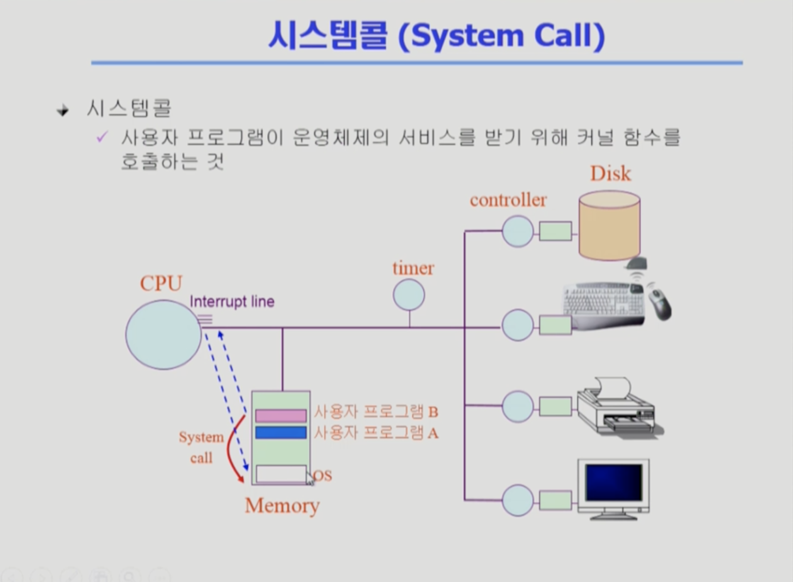
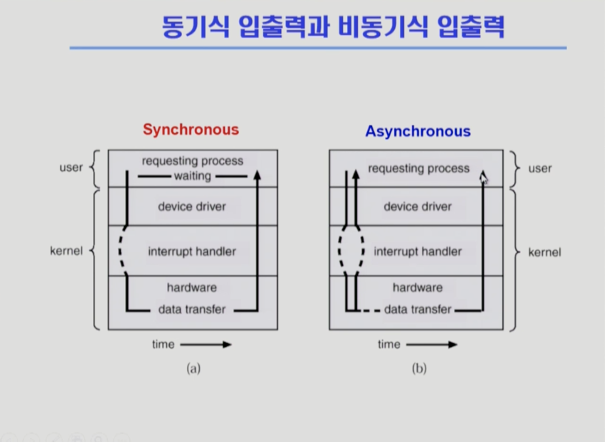
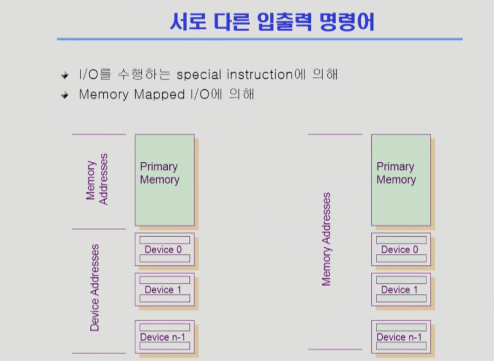
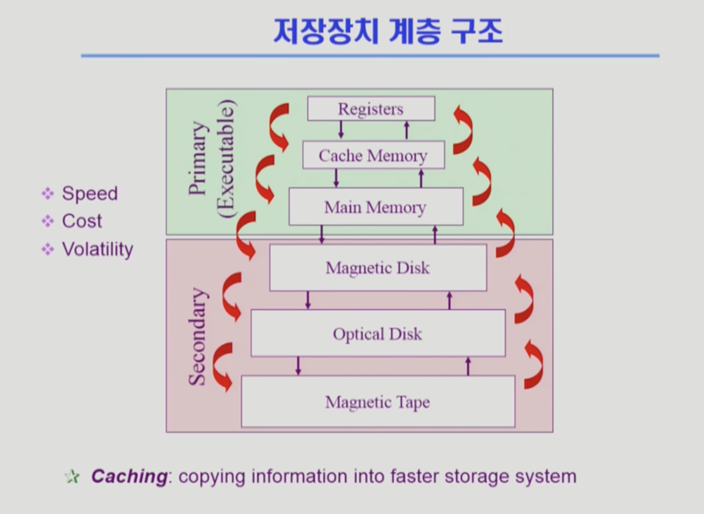
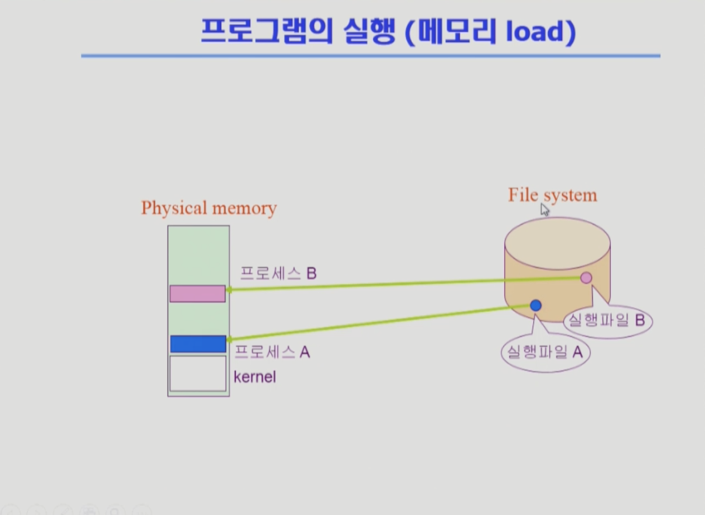
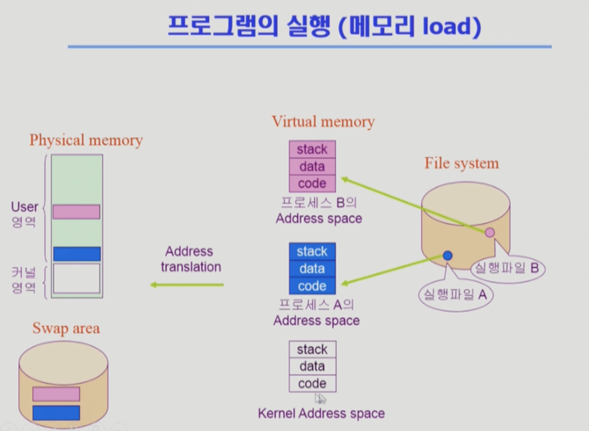
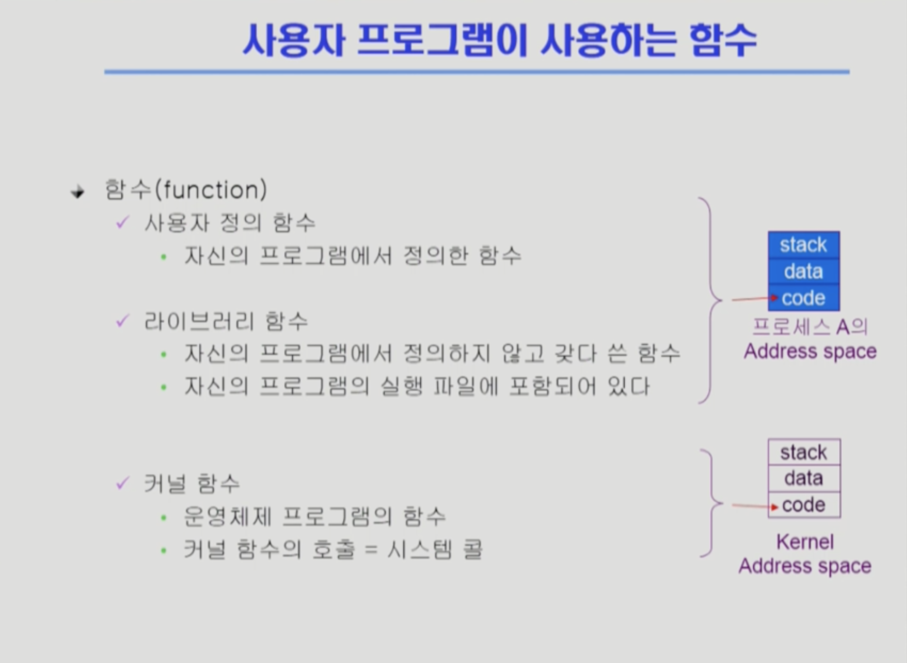
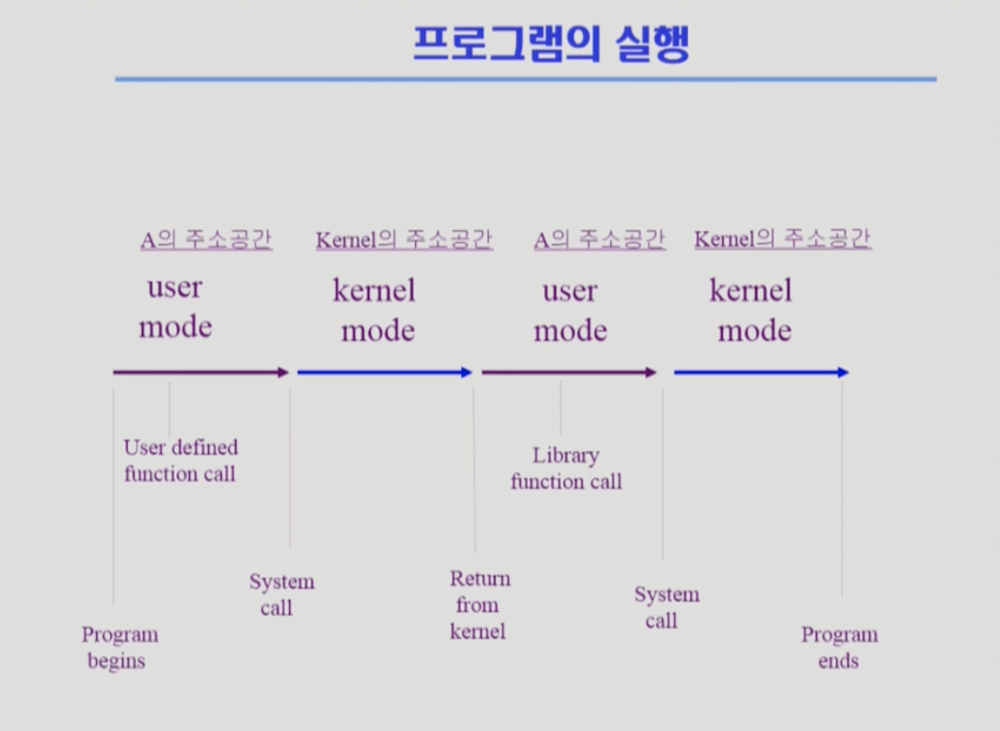

# System Structure & Program Execution 1

## 컴퓨터 시스템 구조

운영 체제를 직접 공부하기에 앞서, 컴퓨터 시스템에서 하드웨어가 어떻게 동작하는지, 그리고 그 하드웨어 위에서 프로그램들이 어떻게 돌아가는지 먼저 알아보자.

### 컴퓨터 시스템의 간단한 하드웨어 구조

#### Computer

- CPU
- Memory

#### I/O Device

I/O는 **Input**과 **Output**을 의미한다.  
**Input**은 I/O Device의 데이터가 컴퓨터 내부로 들어가는 것, **Output**은 컴퓨터 내부에서 처리한 데이터를 다시 I/O Device로 내보내는 것.  

- 하드 디스크
- 키보드/마우스
- 프린터
- 모니터

### 컴퓨터 시스템의 자세한 하드웨어 구조

#### CPU & Memory

**CPU**에서 일을 처리하는 것은 **Instruction(컴퓨터가 알아들을 수 있는 기계어로 이루어진 명령)** 단위로 실행되고, **메모리**는 이 **CPU의 작업 공간**이라고 할 수 있다.  
따라서 CPU는 매 순간, 정확히는 매 **클럭 사이클마다 메모리에서 Instruction을 하나씩 읽어서 실행**되는데 이 과정을 끊임없이 반복한다.

한편 모든 Instruction은 **운영 체제를 통해서만 I/O Device에 접근**할 수 있다.

#### Memory Controller

메모리도 하나의 디바이스이기 때문에, **메모리만을 전담**하는 일종의 작은 CPU.  
CPU와 DMA Controller의 동시 접근과 같은 문제를 중재하는 역할도 담당.

#### DMA Controller

CPU와 더불어 **메모리를 직접 접근**할 수 있는 컨트롤러.  
수많은 I/O Device들이 CPU에 계속해서 직접 응답한다면 CPU는 너무 많은 간섭으로 효율적이지 않게 된다. 따라서 DMA Controller를 두어, **CPU 대신 응답을 처리**한다.  
로컬 버퍼에 쌓인 데이터를 메모리로 복사해 주고, 작업이 끝나면 **CPU에 인터럽트를 한 번만** 걸어서 알려줌.

#### Disk

하드 디스크는 **보통 보조 기억 장치**로 알려져 있지만, **I/O Device**로도 볼 수 있다.  
**데이터를 메모리로부터 읽어**들이는 Input Device 역할, 또 **처리 결과를 디스크의 파일 시스템에 저장**하는 Output Device 역할.

#### Device Controller

각각의 **I/O Device를 전담하는 작은 CPU**.  
디스크에서 헤드의 움직임과 어떤 데이터를 읽을지 통제하는 역할, 그리고 키보드의 입력을 전송하는 역할 등은 메인 CPU가 전담하지 않고 바로 각각의 디바이스 컨트롤러가 담당한다.

#### Local Buffer

CPU의 작업 공간으로 메모리가 있듯이, **디바이스 컨트롤러의 작업 공간**으로는 로컬 버퍼가 존재함.

#### Register

CPU 내부에 메모리보다 더 빠르면서 정보를 저장할 수 있는 공간.

#### Mode Bit

**현재 CPU 내부에서 실행되는 것**이 운영 체제인지, 아니면 사용자 프로그램인지 **구분**한다.

#### Interrupt Line

오직 메모리와 일하는 **CPU에게, 디바이스 컨트롤러에서 넘어오는 인터럽트를 알려준다**.  
CPU와 I/O Device는 성능 차이가 굉장히 많이 난다. 따라서 CPU는 이전에 지시한 요청들을 기다리기보다 계속해서 Instruction을 처리함.

CPU 제어권은 아무리 운영 체제라도 한번 사용자 프로그램으로 넘어가면 마음대로 뺏을 수 없다.한편 인터럽트가 걸리면, CPU가 하던 일을 멈추고 **CPU의 제어권이 사용자 프로그램으로부터 운영 체제로 자동으로 넘어가게 된다**.

#### Timer

특정 프로그램의 **CPU 독점을 막기 위해**, 세팅된 시간이 지나면 **CPU에게 인터럽트**를 걸어주는 역할을 수행하는 하드웨어. CPU의 **Time Sharing**을 구현하기 위함.

## Mode Bit

사용자 프로그램의 잘못된 수행으로 다른 프로그램 및 운영 체제에 피해가 가지 않도록 하기 위한 보호 장치(하드웨어)의 필요성

### Mode Bit의 Operation

- 1 사용자 모드 : 사용자 프로그램 수행
- 0 모니터 모드 : OS 코드 수행

#### 사용자 모드

사용자 프로그램에게 CPU를 넘기기 전에 하드웨어가 Mode Bit을 1로 세팅한다.  
사용자 프로그램이 CPU에서 실행 중일 때는 **제한된 Instruction만 실행 된다**. 이를 **일반 명령**이라고 부른다.

#### 모니터 모드

보안을 해칠 수 있는 중요한 명령어는 모니터 모드에서만 수행 가능한 **특권 명령**으로 규정된다.  
Interrupt나 Exception 발생 시 하드웨어가 Mode Bit을 0으로 세팅한다. 이렇게 운영 체제가 CPU에서 실행 중일 때는 메모리 접근, I/O Device 접근 등 **모든 일을 수행할 수 있다**.  
모니터 모드는 **커널 모드** 또는 **시스템 모드**라고도 불린다.

## Timer

정해진 시간이 흐른 뒤 운영 체제에게 제어권이 넘어가도록 인터럽트를 발생시킨다.  
타이머는 매 Clock Tick 마다 1씩 감소하고, 타이머 값이 0이 되면 타이머 인터럽트 발생.  
CPU를 특정 프로그램이 독점하는 것을 보호함.

타이머는 Time Sharing을 구현하기 위해 이용된다.  
또한 현재 시간을 계산하기 위해서도 사용됨.

## Device Controller

### I/O Device Controller

해당 I/O Device를 관리하는 일종의 작은 CPU.

### 제어 정보를 위한 Register

제어 정보를 위한 레지스터라는 것은 CPU가 어떤 일을 시킬 때, 그 레지스터를 통해서 무슨 일을 하라고 지시하기 위한 것을 의미함.  
**Control Register**, **Status Register**를 가진다.

### 실제 데이터를 저장하는 **Local Buffer**

처리한 데이터들이 실제로 담겨 있는 공간.

따라서 어떤 데이터를 화면에 출력한다면, 실제 데이터는 로컬 버퍼에 담겨 있는 것이고, 화면에 어떤 데이터를 출력하라는 지시는 제어 레지스터에서 관리된다는 것.  
또 다른 예로 어떤 파일을 저장한다면, 데이터 자체는 로컬 버퍼에 넣고, 파일에 저장하라는 명령은 제어 레지스터를 통해 CPU가 I/O Controller에게 전달함.

#### I/O

I/O는 실제 디바이스와 로컬 버퍼 사이에서 일어난다.

#### Device Controller

디바이스 컨트롤러는 I/O가 끝났을 경우 인터럽트로 CPU에 그 사실을 알려준다.

### Device Controller VS Device Drvier

**디바이스 컨트롤러**는 장치제어기, 즉 각 장치를 통제하는 일종의 작은 CPU이다. 따라서 하드웨어.  
반면 **디바이스 드라이버**는 운영 체제 코드 중에서 각 디바이스를 처리하기 위한 인터페이스가 있는데, 이에 맞게 접근할 수 있게 만들어주는 모듈을 말한다. 따라서 소프트웨어.

따라서 하드웨어를 하나 붙이면 그것에 접근하기 위한 디바이스 드라이버를 설치를 해야 되는 것.

#### Device Driver

Instruction 중에서 I/O Device에 접근해야 할 때, 디바이스 드라이버를 통해서 명령을 내림.  
한편 디바이스 드라이버도 일을 수행하기 위한 일종의 매뉴얼이 있는데, 이를 **펌웨어**라고 한다.

## 입출력 (I/O)의 수행

모든 입출력 명령은 특권 명령으로 정의됨.

### 그렇다면 사용자 프로그램은 어떻게 입출력을 하는가?

1. 시스템 콜 발생
2. 트랩을 사용해서 인터럽트 벡터의 특정 위치로 이동
3. 제어권이 인터럽트 벡터가 가리키는 인터럽트 서비스 루틴으로 이동
4. 올바른 I/O 요청인지 확인 후 I/O 수행
5. I/O 완료 시 제어권을 시스템 콜 다음 명령으로 옮김

따라서 **입출력을 위해선 두 가지 종류의 인터럽트**가 걸린다고 볼 수 있다.

- 처음에 사용자 프로그램이 I/O를 요청하기 위한 시스템 콜
- 운영 체제가 시킨 일이 끝난 뒤의 하드웨어 인터럽트

## 인터럽트 (Interrupt)

인터럽트는 당한 시점의 레지스터와 Program Counter를 저장한 후, CPU의 제어를 인터럽트 처리 루틴에 넘긴다.  
사실상 현대의 운영 체제는 인터럽트에 의해 구동된다.  
정작 운영 체제는 CPU를 사용할 일이 거의 없고, 인터럽트가 들어올 때만 CPU가 운영 체제에게 넘어가고 나머지는 항상 사용자 프로그램이 사용 중.

### 인터럽트의 두 가지 의미

1. Interrupt(하드웨어 인터럽트) : 일반적인 하드웨어 발생 인터럽트. 예로, 타이머 기능.
2. Trap(소프트웨어 인터럽트)
    - Exception : 프로그램이 오류를 범한 경우
    - System Call : 프로그램이 커널 함수를 호출하는 경우

### 인터럽트 관련 용어

#### 인터럽트 벡터

인터럽트가 들어왔을 때, 해당 인터럽트는 어떤 주소로 이동해야 하는지 정의해놓은 일종의 테이블.  
인터럽트 번호와 인터럽트 주소가 묶인 쌍을 가지고 있다.

#### 인터럽트 처리 루틴(Interrupt Service Routine, 인터럽트 핸들러)

이미 운영 체제에 내재되어 있는, 해당 인터럽트를 어떻게 처리할 지 정의된 커널 함수 실제 코드.

#### Trap

**프로그램이 직접 인터럽트** 라인을 세팅하는 Instruction. **소프트웨어적** 인터럽트.  
트랩을 사용하여 인터럽트 벡터의 특정 위치로 이동한다.

## 시스템 콜 (System Call)

사용자 프로그램이 운영 체제의 서비스를 받기 위해 I/O를 대신 커널 함수를 호출하는 것.  
이는 일반 함수 호출과는 다르다.  
일반 함수 호출은 메인 함수, 그리고 그 안에서 또 다른 a라는 함수 등을 호출하면서 다음 Instruction의 메모리 주소를 점프하면서 수행된다.

반면 시스템 콜은 단순히 메모리 주소를 바꾸는 일보다 복잡하다. 시스템 콜은 디바이스 컨트롤러가 CPU에 인터럽트를 거는 방식과 유사하다.  
사용자 프로그램이 사용 중이면, Mode Bit이 1인 상태라 I/O에 접근이 불가하다.  
운영 체제에 해당하는 메모리 주소로 넘어가야 하는데, 이를 위해 **프로그램이 직접 인터럽트 라인을 세팅하는 Instruction을 실행**함.  
이를 **Trap**이라고 부름. 다른 말로 소프트웨어 인터럽트.

# System Structure & Program Execution 2

## 동기식 입출력과 비동기식 입출력

입출력은 기본적으로 시간이 오래 걸리는 작업이기 때문에, 이 점을 활용하는 두 가지 입출력 방법이 존재한다.  
그리고 두 경우 모두 I/O 완료는 인터럽트로 알려준다.

### 동기식 입출력 (Synchronous I/O)

I/O 요청 후 입출력 작업이 완료된 후에야 제어권이 사용자 프로그램으로 넘어갈 때.

#### 구현 방법

1. I/O가 완료될 때까지 해당 프로그램이 CPU를 갖고 있음
    - CPU가 낭비됨.
    - 매시점 하나의 I/O만 일어날 수 있다.
2. I/O가 완료될 때까지 해당 프로그램에게서 CPU를 빼앗음
    - I/O가 처리를 기다리는 줄에 그 프로그램을 줄 세운다.
    - 다른 프로그램에게 CPU를 준다.

### 비동기식 입출력 (Asynchronous I/O)

I/O가 시작된 후 입출력 작업이 끝나기를 기다리지 않고 제어권이 사용자 프로그램에 즉시 넘어갈 때.

## 시스템 콜 (System Call)

## DMA (Direct Memory Access)

CPU와 더불어 메모리를 접근할 수 있는 장치.  
디바이스에서 메모리로 직접 카피를 해놓고, **DMA Controller**가 인터럽트를 걸어서 I/O 작업이 끝났다고 알려주는 방식으로 동작한다.

빠른 입출력 장치를 메모리에 가까운 속도로 처리하기 위해 사용.  
CPU의 중재 없이 디바이스 컨트롤러가 디바이스의 버퍼 스토리지의 내용을 메모리에 Block 단위로 직접 전송.  
바이트 단위가 아니라 Block 단위로 인터럽트를 발생시킴. (CPU가 디바이스 컨트롤러에 직접 인터럽트를 너무 많이 당하기 때문에)

## 서로 다른 입출력 명령어

### I/O를 할 수 있는 두 가지 방식

1. I/O를 수행하는 Special Instruction에 의해
    - 메모리만 접근하는 일반적인 I/O 방식
    - 메모리 주소가 있듯이 I/O 디바이스도 특정 주소가 있는데, 이 주소에 대해 접근하는 특정 인스터럭션을 실행
2. Memory Mapped I/O에 의해
    - I/O 디바이스에 직접 메모리 주소를 매겨서 메모리에 접근하는 방식

## 저장장치 계층 구조

위로 갈수록 속도가 빠르고, 단위 공간당 가격이 비싸서 용량이 적고, 휘발성이 강해진다.

### Primary

CPU에서 직접 접근할 수 있는 메모리 스토리지 매체 (바이트 단위로 접근이 가능해야 함).  
휘발적이며 실행 가능하다고 부름.

#### Caching

더 빠른 저장소에 정보를 저장해 놓는 행위.  
용량이 위로 갈수록 작아지기 때문에 새로운 정보가 들어오면 어떤 기존 정보를 내쫓을지 결정하는 것이 캐싱의 주요 이슈.

e.g. CPU는 빠르게는 1 클럭 당 인스터럭션을 하나씩 처리하는데, D램 메모리 접근은 10 클럭까지도 걸리니, 그 속도를 완충하기 위해서 중간에 캐시 메모리를 둔다.

### Secondary

CPU에서 직접 접근할 수 없는 메모리 스토리지 매체(바이트 단위 접근 불가).  
비휘발적.

## 프로그램의 실행 (메모리 Load)

### Physical Memory와 Virtual Memory

보통 프로그램은 실행 파일 형태로 하드 디스크에 저장되어 있다. 그리고 이 실행 파일을 실행시키면 메모리에 올라가서 프로세스가 되면서 실행된다. 비휘발적.  
정확히는 물리적 메모리에 바로 올라가지 않고 중간에 한 단계, 가상 메모리라는 단계를 거친다.  
나중에 이 구조를 이용해 **Virtual Memory 기법**을 배운다.

### Address Space

어떤 프로그램을 실행시키면 형성되는 그 프로그램만의 독자적인 주소 공간.  
프로그램마다 각각 0번지부터 시작하는 공간이 생성된다. 또한 주소 공간은 스택, 데이터, 코드로 이루어져있다.  
그리고 이렇게 올린 주소 공간을 당장 필요한 부분만 물리적 메모리에 올려 프로그램을 실행.  
물론 실제로 연속적으로 어디에 할당되는 것이 아닌, 쪼개져서 Physical Memory나 Swap Area 등에 분포하는 가상 공간이다.

- Stack : 함수로 된 코드들을 호출하고 리턴할 때 사용하는 곳
- Data : 변수, 전역 변수 등 프로그램이 사용하는 자료 구조를 담는다
- Code : CPU에서 실행할 기계화 코드

### Swap Area

메모리 낭비를 막기 위해, 당장 필요하진 않지만 보관하고 있어야 하는 부분을 내려놓는 공간.  
메모리 용량의 한계 때문에 연장 공간으로서 사용할 뿐, 휘발적이다.

### Address Translation

물리적 메모리도 사실 0번지부터 시작하는 주소다. 아래쪽에서 올라갈수록 주소가 증가하는데, 이렇게 주소를 바꾸는 것을 주소 변환이라고 한다.

주소 변환은 운영 체제가 담당하진 않고 하드웨어 장치의 지원을 받는다.

## 커널 주소 공간의 내용

운영 체제 커널도 사실은 하나의 프로그램. 따라서 코드/데이터/스택의 주소 공간을 지닌다.

### Code

자원을 효율적으로 관리하는 것이 목표인 운영 체제. 그리고 사용자에게 편리한 인터페이스를 제공하는 것.

### Data

운영 체제가 사용하는 여러 자료 구조들에 대한 정의 저장.  
또한 운영 체제는 CPU나 메모리, 디스크 등의 하드웨어를 직접 관리하므로 종류마다 자료 구조 저장.

#### PCB (Process Control Blcok)

시스템 안에 프로그램이 실행되면, 그 프로그램을 관리하기 위해 하나씩 만들어지는 자료 구조.

### Stack

운영 체제는 사용자 프로그램들이 요청에 따라 얼마든지 불러 쓸 수 있다(시스템 콜).  
따라서 각각의 프로세스마다 커널 스택 존재.

## 사용자 프로그램이 사용하는 함수

### 함수의 종류

#### 사용자 정의 함수 (User Mode 기반)

자신의 프로그램에서 정의한 함수

#### 라이브러리 함수 (User Mode 기반)

자신의 프로그램에서 정의하지 않고 가져다 쓴 함수. 다른 누군가가 만들어 놨음.  
자신의 프로그램의 실행 파일에 모두 포함되어 있다.

#### 커널 함수 (Kernel Mode 기반)

운영 체제 프로그램의 함수.  
커널 함수의 호출 = 시스템 콜.

## 프로그램의 실행

