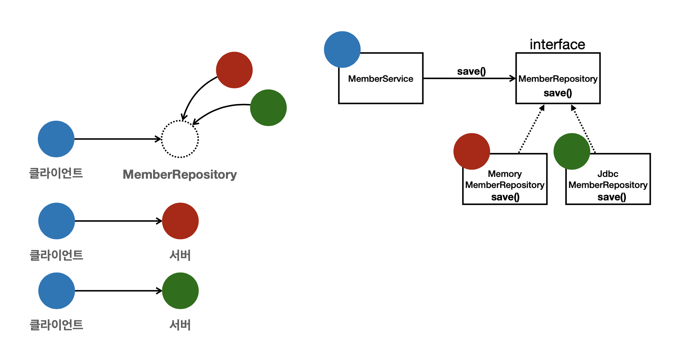
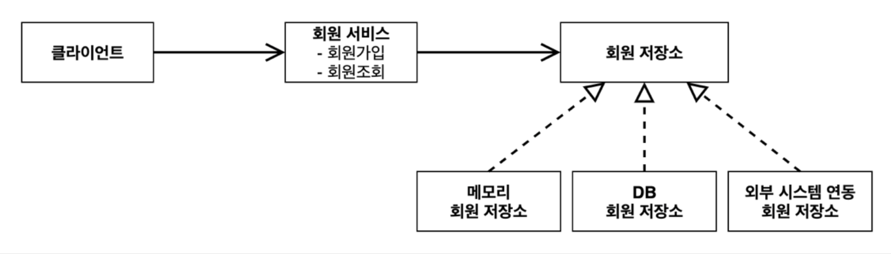
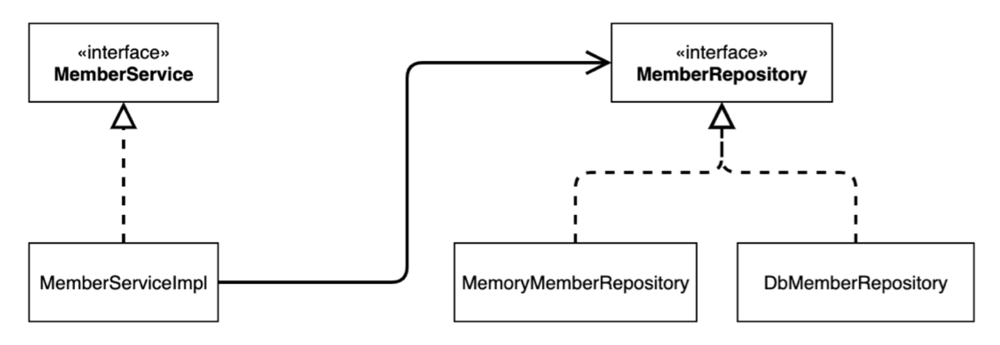
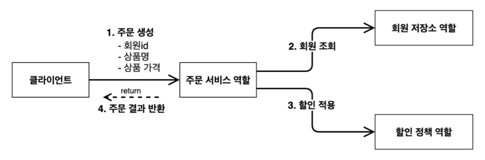
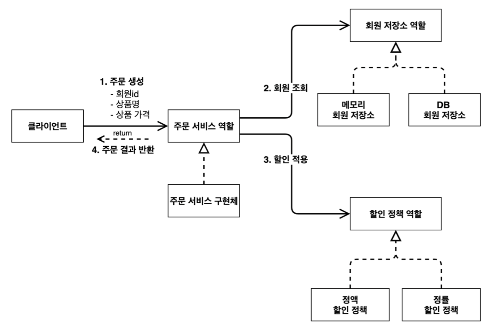
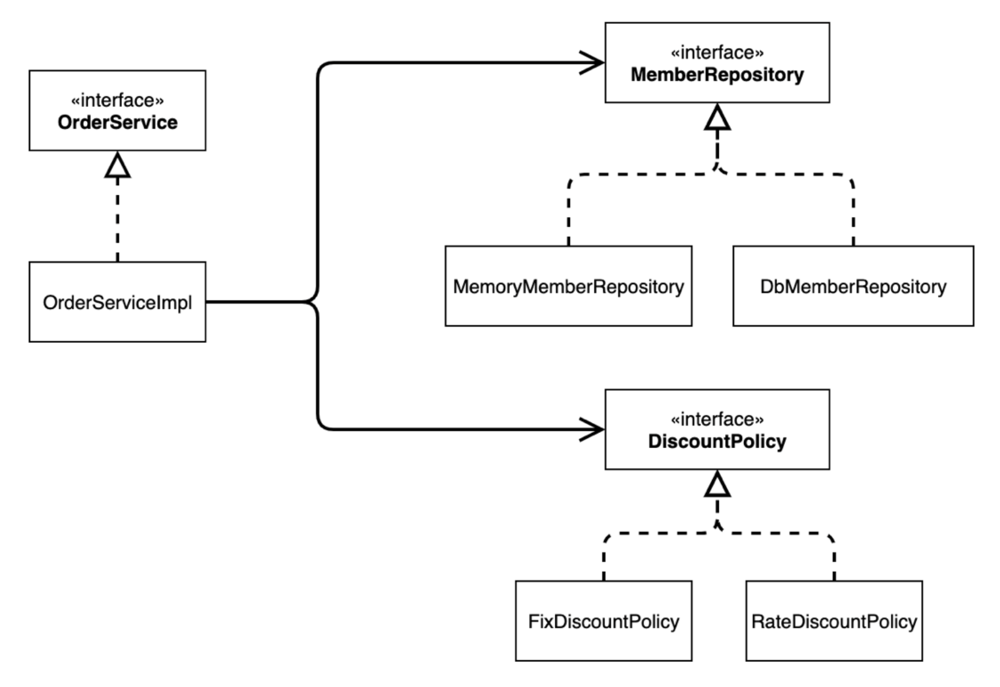
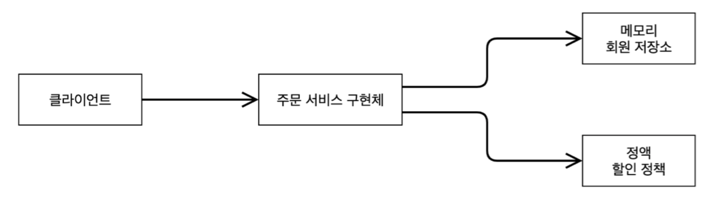
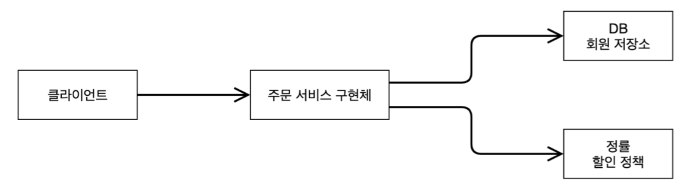

# [스프링 핵심 원리 - 기본편] 강의 소개

> [스프링 핵심 원리 - 기본편](https://www.inflearn.com/course/%EC%8A%A4%ED%94%84%EB%A7%81-%ED%95%B5%EC%8B%AC-%EC%9B%90%EB%A6%AC-%EA%B8%B0%EB%B3%B8%ED%8E%B8)

# 객체 지향 설계와 스프링

## 자바 진영의 추운 겨울과 스프링의 탄생

2000년 초기에는 자바 기술의 표준이 **EJB(Enterprise Java Beans)**.  
이 EJB는 이론 자체는 좋았지만, 복잡하고 어렵고 느리다는 치명적인 단점 존재.

그래서 이후에 EJB를 버리고 다시 순수한 옛날 자바, 즉 **POJO(Plain Old Java Object)** 로 돌아가자는 기조가 생겼다.

이렇게 EJB를 대체하고자 새로 오픈소스 두 가지가 만들어졌는데, 바로 Rod Johnson의 **Spring**과 Gavin King의 **Hibernate**.

- **스프링**
    - EJB 컨테이너 대체
    - 단순함의 승리
    - 사실상 현재 표준 기술
- **하이버네이트**
    - EJB 엔티티 빈 기술을 대체
    - 하이버네이트를 기반으로 만든 **JPA(Java Persistence API)** 가 새로운 자바 표준으로 정의됨

JPA 같은 표준 기술은 인터페이스만 있고, 구현체는 따로 만들어야 한다.  
그래서 지금은 JPA라는 표준 인터페이스와 그 구현체들로 Hiberante, EclipseLink 등이 존재함.  
결과적으로 자바 ORM 시장은 JPA가 지배하고, 구현체로는 80% 이상이 Hibernate.

따라서 **자바 진영의 제일 중요한 두 가지는 스프링과 JPA**.

### 스프링 탄생

2002년 Rod Johnson(로드 존슨)의 책이 출간되어 EJB의 문제점을 지적함.  
EJB 없이도 충분히 고품질의 확장 가능한 애플리케이션을 개발할 수 있음을 보여주고, 30,000 라인 이상의 기반 기술을 예제 코드로 선보임.  
여기에 지금 스프링 핵심 개념과 기반 코드가 들어있다(BeanFactory, ApplicationContext, POJO, 제어의 역전, 의존관계 주입).

책 출간 직후 Juergen Hoeller(유겐 휠러), Yann Caroff(얀 카로프)가 로드 존슨에게 오픈소스 프로젝트를 제안함.  
스프링의 핵심 코드의 상당수는 유겐 휠러가 지금도 개발.  
**스프링 이름**은 전통적인 J2EE(EJB)라는 겨울을 넘어 **새로운 시작이라는 뜻**으로 지음.

왜 스프링을 쓰는데 이런 역사를 알아야할까?  
강의의 시작은 스프링의 처음과 같다. 스프링과 비슷한 코드를 짜면서 한 단계씩 왜 스프링이 필요하고 대단한지 느끼게 될 것.

## 스프링이란?

스프링은 특정 하나를 지칭하기 보다는 여러 기술들의 모음이다.

### 스프링 생태계

- 필수
    - **스프링 프레임워크**
    - **스프링 부트**
- 선택
    - 스프링 데이터
    - 스프링 세션
    - 스프링 시큐리티
    - 스프링 Rest Docs
    - 스프링 배치
    - 스프링 클라우드

### 스프링 프레임워크

- 핵심 기술 : 스프링 DI 컨테이너, AOP, 이벤트, 기타
- 웹 기술 : 스프링 MVC, 스프링 WebFlux
- 데이터 접근 기술 : 트랜잭션, JDBC, ORM 지원, XML 지원
- 기술 통합 : 캐시, 이메일, 원격접근, 스케줄링
- 테스트 : 스프링 기반 테스트 지원
- 언어 : 코틀린, 그루비

이러한 스프링 기술 중에 가장 중요한 것이 스프링 프레임워크이고, 이 모든 기술을 사용하도록 도와주는 것이 스프링 부트.  
이 **강의에서 초점**을 두는 부분은 **스프링 프레임워크의 핵심 기술(스프링 DI 컨테이너, AOP, 이벤트, 기타)**. 나머지는 전부 파생적인 부분이다.

### 스프링 부트

- 스프링을 편리하게 사용할 수 있도록 지원, 최근에는 스프링 프레임워크와 함께 거의 기본으로 사용
- 단독으로 실행할 수 있는 스프링 애플리케이션을 쉽게 생성
- Tomcat 같은 웹 서버를 내장해서 별도의 웹 서버를 설치하지 않아도 됨
- 손쉬운 빌드 구성을 위한 starter 종속성 제공(라이브러리를 쓸 때 필요한 것들을 알아서 땡겨줌)
- 스프링과 3rd party(외부) 라이브러리 자동 구성
- 메트릭(운영 단계), 상태 확인, 외부 구성 같은 프로덕션 준비 기능 제공
- 관례에 의한 간결한 설정

**스프링 부트**는 스프링 프레임워크와 **별도로 사용할 수 있는 것이 아니다**.  
스프링 부트는 여러 스프링 프레임워크, 데이터 등의 것들을 중간에서 **편리하게 사용할 수 있게 기능을 제공**하는 것이다.  어떻게 보면 껍데기 기능.  
말 그대로 프레임워크가 돌아가도록 도와주는 기술이지 , 스프링 부트만으로 돌아가는 것은 아니다.

### 스프링 단어?

스프링이라는 단어는 문맥에 따라 다르게 사용되기도 한다.

- 스프링 DI 컨테이너 기술
- 스프링 프레임워크
- 스프링 부트, 스프링 프레임워크 등을 모두 포함한 스프링 생태계 전반

### 스프링 핵심 개념

왜 스프링을 만들었을까? 스프링의 핵심은?

- 스프링은 자바 언어 기반의 프레임워크
- 자바 언어의 가장 큰 특징 - **객체 지향 언어**
- 스프링은 객체 지향 언어가 가진 강력한 특징을 살려내는 프레임워크
- 스프링은 **좋은 객체 지향 애플리케이션을 개발할 수 있게 도와주는 프레임워크(도구)**

단순히 스프링의 API 사용법을 아는 게 아니라, 핵심 컨셉을 알아야 한다.

## 좋은 객체 지향 프로그래밍이란?

### 객체 지향 프로그래밍

객체 지향 프로그래밍은 컴퓨터 프로그래밍을 명령어의 목록으로 보는 시각에서 벗어나 여러 개의 독립된 단위, 즉 "**객체**"들의 **모임**으로 파악하고자 한다. 각각의 **객체**는 **메시지**를 주고받고, 데이터를 처리할 수 있다. (**협력**)

객체 지향 프로그래밍은 프로그램을 **유연**하고 **변경**이 용이하게 만들기 때문에 대규모 소프트웨어 개발에 많이 사용된다.

- 유연하고 변경이 용이? 바로 **다형성**

### 다형성의 실세계 비유

**역할**과 **구현**으로 세상을 구분한다.  
역할은 **인터페이스**, 구현은 (인터페이스를 구현한) **객체**

- e.g. 운전자 - 자동차
    - 운전자 '역할'과 자동차 '역할'이 존재
    - 자동차 '역할'에 맞게 자동차 '구현'으로는 K3, 아반떼, 테슬라 모델3 등이 존재
    - 운전자(클라이언트)는 자동차의 내부 구조를 몰라도 된다. 또한 자동차 종류가 바뀌어도 운전에 영향 X
        - 따라서 자동차의 설계는 모두 운전자, 즉 **클라이언트를 위한 설계**
        - **다형성의 핵심** : 자동차에 새로운 기능을 추가해도 **클라이언트에 영향을 주지 않고** 기능 제공 가능
- e.g. 로미오와 줄리엣 공연
    - 로미오 '역할'과 줄리엣 '역할'을 배우들이 '구현'

### 역할과 구현을 분리

역할과 구현의 분리는 세상을 **단순**하고, **유연**해지며 **변경**도 편리하게 만들 수 있다.  
무엇보다 **클라이언트에 도움**을 준다.

- 대상의 역할(인터페이스)만 알면 된다
- 구현 대상의 내부 구조를 몰라도 된다
- 구현 대상의 내부 구조가 변경되어도 영향을 받지 않는다
- 구현 대상 자체를 변경해도 영향을 받지 않는다.

#### 자바에 적용

자바 언어의 다형성을 활용한다. (**오버라이딩**)  
오버라이딩 된 메서드가 실행되면서, 다형성으로 인터페이스를 구현한 객체를 실행 시점에 유연하게 변경 가능.  
클래스 상속 관계도 물론 다형성, 즉 오버라이딩을 적용 가능.

- 역할 : 인터페이스
- 구현 : 인터페이스를 구현한 클래스, 구현 객체

객체를 설계할 때 역할과 구현을 명확히 분리한다. 구현보다 인터페이스가 먼저다.  
**먼저 역할(인터페이스)를 부여**하고, 그 역할을 수행하는 **구현 객체를 만드는 순서**로.  

#### 객체의 협력이라는 관계부터 생각 (클라이언트 - 서버)

혼자 있는 객체는 없다.  
클라이언트는 **요청**하고, 서버는 **응답**한다.  수많은 객체 **클라이언트와 객체 서버**는 **서로 협력 관계**를 가진다.



```java
public class MemberService {
    private MemberRepository memberRepository = new MemoryMemberRepository();
}
```

```java
public class MemberService {
    //private MemberRepository memberRepository = new MemoryMemberRepository();
    private MemberRepository memberRepository = new JdbcMemberRepository();
}
```

#### 다형성의 본질

다형성의 본질은 **클라이언트를 변경하지 않고, 서버의 구현 기능을 유연하게 변경할 수 있다**는 것.

- 인터페이스를 구현한 객체 인스턴스를 **실행 시점**에 **유연**하게 **변경** 가능
- **협력**이라는 객체 사이의 관계에서 시작해야 함

#### 정리

- 장점
    - 실세계의 역할과 구현이라는 편리한 컨셉을 다형성을 통해 객체 세상으로 가져올 수 있다
    - 유연하고 변경이 용이
    - 확장 가능한 설계
    - 클라이언트에 영향을 주지 않고 변경
    - 최초 설계 시, 인터페이스를 안정적으로 설계하는 것이 중요
- 한계
    - 역할(인터페이스) 자체가 변하면 클라이언트, 서버 모두 큰 변경이 발생
    - e.g. 자동차를 비행기로 변경해야 한다면?

### 스프링과 객체 지향

객체 지향의 꽃은 다형성. 다형성이 가장 중요하다(이후에 나오는 + SOLID까지). 그렇다면 **스프링에서 왜 다형성 얘기?**

**스프링**(컨테이너)은 **다형성을 극대화해서 이용할 수 있게 도움**.  
스프링에서 이야기하는 제어의 역전(IoC), 의존관계 주입(DI)은 다형성을 활용해 역할과 구현을 편리하게 다룰 수 있도록 지원.  
스프링을 사용하면 공연 무대의 배우를 선택하듯이 구현을 편리하게 사용 가능.

## 좋은 객체 지향 설계의 5가지 원칙(SOLID)

SOLID는 클린코드로 유명한 Robert C. Martin이 좋은 객체 지향 설계의 5가지 원칙을 정리한 것.

- SRP : 단일 책임 원칙 (Single Responsibility Principle)
- OCP : 개방-폐쇄 원칙 (Open/Closed Principle)
- LSP : 리스코프 치환 원칙 (Liskov Substitution Principle)
- ISP : 인터페이스 분리 원칙 (Interface Segregation Principle)
- DI : 의존관계 역전 원칙 (Dependency Inversion)

### SRP, 단일 책임 원칙

**하나의 클래스는 하나의 책임**만 가져야 한다.

하나의 책임이란 모호한 부분이 있다. 클 수도, 작을 수도 있어 문맥과 상황에 따라 다름.  
중요한 기준은 **변경**. 변경이 있을 때 파급 효과가 적으면 SRP를 잘 따른 것.

### OCP, 개방-폐쇄 원칙

소프트웨어 요소는 **확장에는 열려**있으나 **변경에는 닫혀**있어야 한다.

말이 앞뒤가 맞지 않는 것처럼 보임. 확장을 위해선 당연히 코드가 변경된다. 그럼 여기서 **다형성**을 활용해보자.  
인터페이스를 구현한 **새로운 클래스**를 하나 만들어서 새로운 기능 구현하는 것이다. 새로 만드는 것 자체는 기존 코드를 변경하지 않게 된다.

```java
public class MemberService {
    private MemberRepository memberRepository = new MemoryMemberRepository();
}
```

```java
public class MemberService {
    //private MemberRepository memberRepository = new MemoryMemberRepository();
    private MemberRepository memberRepository = new JdbcMemberRepository();
}
```

위 코드를 보면 OCP를 만족하는 것처럼 보이다가도, **결국 코드가** `new JdbcMemberRepository()`**로 변경**되는 것을 확인할 수 있다.  
코드가 변경되는데? 분명 **다형성을 사용했지만 OCP 원칙을 못 지킴**.

이 문제를 해결하기 위해선 객체를 생성하고, 연관관계를 맺어주는 **별도의 조립, 설정자**가 필요.  
바로 여기서 **스프링, 컨테이너**가 필요함.

### LSP, 리스코프 치환 원칙

프로그램의 객체는 프로그램의 **정확성을 깨뜨리지 않으면서** 하위 타입의 **인스턴스로 바꿀 수 있어야** 한다.

다형성에서 하위 클래스는 인터페이스 규약을 다 지켜야 한다는 것.  
인터페이스를 구현한 구현체를 믿고 사용하려면 이 규약이 필요함. 컴파일 단계의 성공을 넘어서는 이야기.  
성능은 차치하더라도 기본적인 기능만 지원하면 LSP 성립.

e.g. 자동차 인터페이스의 엑셀은 앞으로 이동하는 기능이다. 속도는 빠르더라도 만약 뒤로 이동하면 LSP 위반.

### ISP, 인터페이스 분리 원칙

특정 클라이언트를 위한 **인터페이스 여러 개가 범용 인터페이스 하나보다 낫다**.  
ISP를 통해 인터페이스가 명확해지고, 대체 가능성이 높아진다.

e.g.  
자동차 인터페이스 -> 운전 인터페이스, 정비 인터페이스로 분리  
사용자 클라이언트 -> 운전자 클라이언트, 정비사 클라이언트로 분리  
분리하면 정비 인터페이스 자체가 변해도 운전자 클라이언트에 전혀 영향을 주지 않는다.

### DIP, 의존관계 역전 원칙

프로그래머는 "**추상화에 의존해야지, 구체화에 의존하면 안된다**.", 는 원칙을 따르는 방법 중 하나.

쉽게 얘기해, 구현 클래스에 의존하지 말고 인터페이스에 의존하라는 뜻.  
의존한다는 것은 '저 코드를 알고 있다'라고 이해해도 됨.

앞에서 다룬 **역할에 의존**하고 **구현에 의존하지 말라**는 것과 동일. 객체 세상도 클라이언트가 인터페이스에 의존해야 유연하게 구현체 변경 가능.  
구현체에 의존하게 되면 변경이 어려워진다.

```java
public class MemberService {
    private MemberRepository memberRepository = new MemoryMemberRepository();
}
```

```java
public class MemberService {
    //private MemberRepository memberRepository = new MemoryMemberRepository();
    private MemberRepository memberRepository = new JdbcMemberRepository();
}
```

위 코드를 보면 DIP를 지키기 위해선, `MemberService` 클라이언트가 `MemberRepository` 인터페이스만 바라보고, `MemoryMemberRepository`나 `JdbcMemberRepository`를 몰라야 한다.  
하지만 코드에서는 인터페이스와 동시에 구현 클래스도 직접 선택하며 의존하고 있다.  
따라서 **DIP 위반**!

### 정리

객체 지향의 핵심은 다형성이다.  
그렇지만 **다형성 만으로는** 구현 객체를 변경할 때, 클라이언트 코드도 함께 변경되며 **OCP, DIP를 지킬 수 없다**.  
**뭔가 더 필요**하다는 결론이 도출.

## 객체 지향 설계와 스프링

### 스프링과 객체 지향

**스프링은 다음 기술로 다형성 + OCP, DIP를 가능하게 지원**

- DI(Dependency Injection) :  의존관계, 의존성 주입
- DI 컨테이너 제공

**클라이언트 코드의 변경 없이 기능 확장**, 그리고 쉽게 부품을 교체하듯이 개발 가능.

### 스프링이 없던 시절

예전엔 좋은 객체 지향 개발을 하려고 OCP, DIP 원칙을 지키면서 개발하다보면 너무 할 일이 많았다. 배보다 배꼽이 큰 상황.  
그래서 스프링은 프레임워크로 만들어버림.

순수하게 자바로 OCP, DIP 원칙을 지키며 개발하면 결국 스프링 프레임워크를 만들게 된다. (정확히는 DI 컨테이너)  
앞으로 코드를 직접 치면서 스프링 탄생 이유를 이해할 것.

### 정리

모든 설계에 **역할**과 **구현**을 분리하자. 그리고 구현보다는 인터페이스를 먼저 설계하는 습관 필요.  
애플리케이션 설계도 공연을 설계하듯 배역만 만들어두고, 배우는 언제든지 **유연**하게 **변경**할 수 있도록 만드는 것이 좋은 객체 지향 설계.  
이상적으로는 모든 설계에 인터페이스를 부여하자.

#### 실무 고민

하지만 인터페이스를 도입하면 **추상화 비용**(개발자가 한번 더 코드를 열어보는)이 발생한다.  
따라서 기능을 확장할 가능성이 없으면, 구체 클래스 직접 사용. 또는 향후에 필요한 경우에 따로 리팩터링으로 인터페이스 도입.

# 스프링 핵심 원리 이해1 - 예제 만들기

## 프로젝트 생성

스프링의 도움 없이, 순수한 자바로만 역할과 구현을 나누어서 개발하기 목표.

## 비즈니스 요구사항과 설계

### 회원

- **기능**
    - 회원 가입
    - 회원 조회
- **등급**
    - 일반
    - VIP
- **데이터베이스**
    - 자체 DB
    - 외부 시스템 연동

### 주문 & 할인 정책

- **주문**
    - 회원이 상품 주문
- **할인 정책**
    - 회원 등급에 따라 다른 할인
        - VIP는 1000원 고정 할인 (이후 변경 가능)

## 회원 도메인 설계

### 도메인 협력 관계

기획자들도 볼 수 있음. 도메인에 관한 큰 그림.



메모리 회원 저장소라는 간단한 저장소를 먼저 만들어서 테스트, 로컬 개발 등으로 이용.  
이후에 외부 데이터베이스가 선택되면 교체.

### 클래스 다이어그램

개발자들이 구체화한 실제 구현 레벨.  
서버를 실행하지 않고 클래스들만 구성해서 볼 수 있는 그림. 따라서 정적이다.



### 객체 다이어그램

실제 객체간의 참조.  
서버가 실제로 떴을 때, 어떤 구현체를 사용하는지 볼 수 있음. 따라서 동적이다.


회원 서비스는 `MemberServiceImpl` 구현체를 사용함.

## 회원 도메인 개발

### 메모리 회원 저장소 구현체

```java
public class MemoryMemberRepository implements MemberRepository {
    
    private static Map<Long, Member> store = new HashMap<>();
    
    @Override
    public void save(Member member) {
        store.put(member.getId(), member);
    }
    
    @Override
    public Member findById(Long memberId) {
        return store.get(memberId);
    }
}
```

데이터베이스가 아직 확정되지 않았지만, 개발을 위해 일단 가장 간단한 메모리 회원 저장소를 구현.

데이터 저장소이기 때문에 id값과 Member를 같이 묶음으로 저장하는 Map이 필요하다.  
참고로, `HashMap`은 동시성 이슈 발생 가능. 따라서 실제로는 `ConcurrentHashMap` 이용.

## 회원 도메인 실행과 테스트

### 회원 도메인 - 회원 가입 테스트

```java
class MemberServiceTest {
    
    MemberService memberService = new MemberServiceImpl();
    
    @Test
    void join() {
        //given
        Member member = new Member(1L, "memberA", Grade.VIP);
        
        //when
        memberService.join(member);
        Member findMember = memberService.findMember(1L);
        
        //then
        Assertions.assertThat(member).isEqualTo(findMember);
    }
}
```

테스트는 애플리케이션 로직으로 테스트 하는 것보다, 위 코드처럼 **JUnit 테스트 프레임워크**를 이용하는 것이 좋다.  
또한 테스트 메서드는 **given, when, then** 의 3단 구조가 편리.

### 설계한 회원 도메인의 문제점

```java
public class MemberServiceImpl implements MemberService {
    
    private final MemberRepository memberRepository = new MemoryMemberRepository();
    
    public void join(Member member) {
        memberRepository.save(member);
    }
    
    public Member findMember(Long memberId) {
        return memberRepository.findById(memberId);
    }
}
```

 `MemberServiceImpl` 은 현재 `MemoryMemberRepository`, 즉 **구현체에 의존**하고 있다.

`MemberRepository`라는 인터페이스, 즉 추상에 의존하는 것은 괜찮지만 이렇게 구현체에 의존하면 현재 임시로 쓰고 있는 메모리 저장소에서 다른 저장소로 변경할 때 **OCP 원칙을 준수할 수 없고**, 이 자체로 **DIP도 위반**하고 있다.

이 문제는 이후에 주문 도메인까지 개발한 뒤 함께 해결할 것.

## 주문과 할인 도메인 설계

### 주문 도메인 협력, 역할, 책임



### 주문 도메인 전체



주문 서비스나 회원 저장소의 "역할"을 먼저 만들고 이후에 그 구현을 만든다.  
역할이 우선되면 이후에 구현체는 자유롭게 빼고 끼울 수 있다.

### 주문 도메인 클래스 다이어그램



### 주문 도메인 객체 다이어그램1



회원을 메모리에서 조회하고, 정액 할인 정책을 지원해도 주문 서비스를 변경하지 않아도 된다(**협력 관계 그대로 재사용**).

### 주문 도메인 객체 다이어그램2



회원을 메모리가 아닌 실제 DB에서 조회하고, 정률 할인 정책을 지원해도 주문 서비스를 변경하지 않아도 된다(**협력 관계 그대로 재사용**).

## 주문과 할인 도메인 개발

할인 정책 인터페이스, 정액 할인 정책 구현체를 만들어 할인 도메인을 먼저 개발.  
그리고 주문 엔티티, 주문 서비스 인터페이스, 주문 서비스 구현체를 만들어 주문 도메인 개발.

### 주문 서비스 구현체

```java
public class OrderServiceImpl implements OrderService {
    
    private final MemberRepository memberRepository = new MemoryMemberRepository();
    private final DiscountPolicy discountPolicy = new FixDiscountPolicy();
    
    @Override
    public Order createOrder(Long memberId, String itemName, int itemPrice) {
        Member member = discountPolicy.discount(member, itemPrice);
        int discountPrice = discountPolicy.discount(member, itemPrice);
        
        return new Order(memberId, itemName, itemPrice, discountPrice);
    }
}
```

주문 생성 요청이 오면, 회원 정보를 먼저 조회한 뒤, 할인 정책을 적용한 다음 주문 객체를 생성해서 반환한다.  
**메모리 회원 리포지토리와 정액 할인 정책을 구현체로 생성**한다.

위의 코드 라인 9에서는, 구현체가 할인을 하는지, 또 한다면 얼마나 하는지 모르므로 SRP 원칙을 지켰다고 볼 수 있음.  
한편 회원 도메인 개발에서 나타났듯, 여전히 **주문 도메인에서도 OCP, DIP 원칙을 위반**한 문제가 존재함.

# 스프링 핵심 원리 이해2 - 객체 지향 원리 적용

## 새로운 할인 정책 개발

기존에 VIP를 대상으로 1000원씩 할인하던 정책에서, 주문 금액에 따라 10%씩 할인하는 정률 할인 정책으로 변경해보자.  
따라서 `RateDiscountPolicy` 구현체를 추가.
